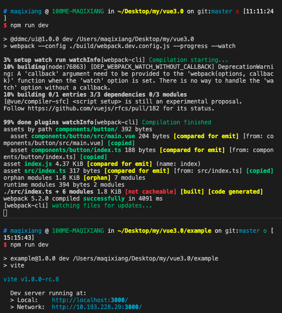

# vue3.0 + webpack + vite 开发组件库

在之前的文章里面，介绍了vite以及vue3.0相关的内容，但是纸上谈来终觉浅，所以还是需要实践的操作一下，才能理解到内部的真实内容

本篇文章讲解了最近通过`vue3.0`和`vite`两大比较热门的技术来开发组件库

[github地址](https://github.com/HuskyToMa/vue3Component)

相信使用vue的同学，对于vue-cli这么一整套的内容是相当的熟悉了，现在就不使用vue-cli了，直接通过自己手工搭建一个完整的组件库的项目

## 确定唯一的技术选型

这点我们这边很明确， 是基于vue3.0的项目

除了vue以外，针对于ts跟js的选型也是比较重要的，在现在这阶段，或者说再过几年，如果你还是不能够使用ts来进行开发的话，那么就很容易成为过去式=,=

而且，就针对组件库而言，我们的组件被外部调用的时候，并无法确定外部业务存在的环境是ts还是js，所以无论如何，你的types文件是必不可少的

那么，就很容易的得出结论，组件库的编写，至少在script的层面上，我们就选择了`typescript`

而vue的模板文件除了js以外还有template与style，这两个的考虑的话就有点无所谓的感觉了，用什么样式其实都行，我这边选择了`scss`

## 开发与生产环境

确认完我们的技术选型之后，就可以开始搭建我们整个项目的基架了

首先考虑我们生产环境跟开发环境的区别

为了让开发环境能够体会到秒开的感觉，不需要编译之后还要编译半天等结果才能够显示在界面上，所以在开发环境的选择上我使用`vite + webpack`

### 安装webpack，vite

> npm i webpack webpack-cli vite -D

vite是在开发环境使用的一个工具，而不是针对整个组件库进行生产跟开发环境使用的，这样就很明确的分出了webpack跟vite的具体使用场景

1. 对于组件库的打包，使用的是webpack
2. 对于组件库的demo，使用vite来进行开发

以下只会讲相关的配置，详细的配置说明这边就不叙述了， 如果想看的话可以通过[github](https://github.com/HuskyToMa/vue3Component)的链接去查看相关的配置

先来看下具体实现之后的效果图

先来看下这种图的上一部分，他是使用了`watch`的方式，而不是通过`webpack-dev-server`，原因在于，如果使用了`webpack-dev-server`，那么在这个开发环境中会默认生成一个服务，而这个服务并不是我们所需要的，我们需要的仅仅是他打包完成之后生成的那个bundle文件，所以只需要通过打生产包的形式来让我们的组件库能够在开发环境中使用即可

而下一部分指的内容就是`vite`在`example`文件夹中启动的，在不同项目之间相互使用是通过了`npm link`的方式

在这边存在一个问题：

vite自身的体系是不会去解析amd或者cmd的模块化方案的js文件，这就导致了我们通过webpack打包后的文件是无法直接使用在vite里面的，为了简单的解决这个问题，使用了`copy-webpack-plugin`，直接将当前需要用的两个文件目录`src components`直接复制进打包后的页面，然后修改`package.json`中的`main`字段，将其直接指向当前的`lib`目录，即打包后的目录，而不是直接指向当前的具体文件

### 安装ts

> npm i typescript ts-loader -D

## 一个合格的编码规范

不管是从业务层面的开发，还是基于基建项目的开发，一个合适的编码规范尤为重要

相同的编码习惯，虽然不能带来效率上的提升，但是对团队的协作上面，能够起到一种催化剂的作用，更甚者，在不同的编码条件下还有可能会减少一定量的合并冲突

## 代码的健壮性

## 文档

## 发布与使用
