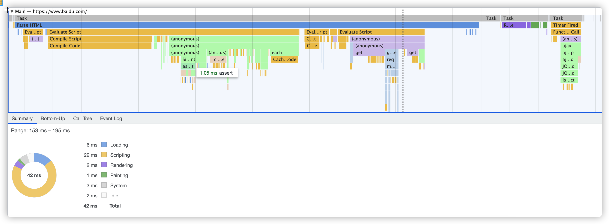
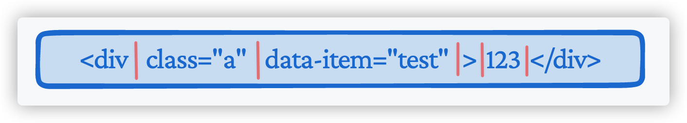
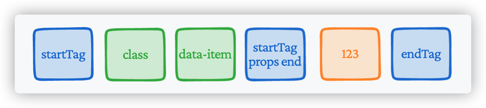
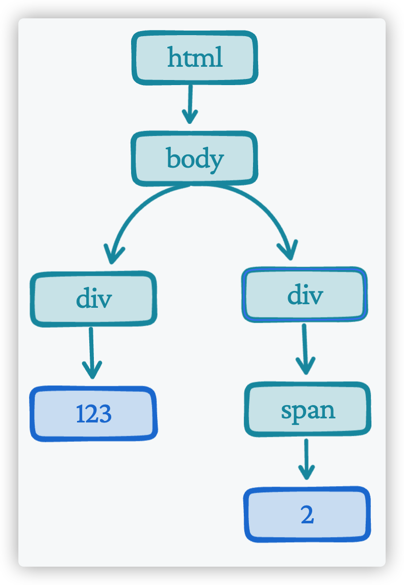
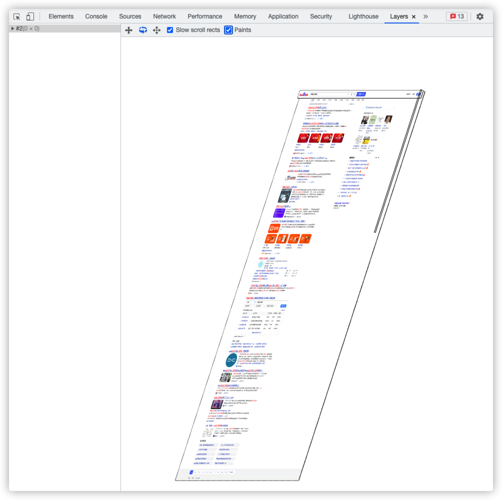

# 从浏览器渲染到性能优化

我们经常能看到一个面试题`详细的描述下从输入url到页面渲染的整个过程`，当然我也相信这个问题很多人都已经背的滚瓜烂熟，今天我想讲点不一样的，那就是不讲请求，只讲渲染跟性能的关系

## 浏览器渲染

我们知道从接口返回出来的其实就是一串待解析的数据流，浏览器通过不同的类型规则进行相应的解析动作，正常来讲，我们访问页面的时候返回的都是html，所以这边的渲染以及后续的性能优化主要都是针对与浏览器解析html并渲染的一整个过程

先看下一张图，这是通过`devtool`打开`performance`的图片



不难看出，这里存在这一次从解析到渲染的整个流程，除了浏览器的默认`task`以外，同一个主线程他跑成了三个大模块「也就是蓝色，紫色，绿色」，分别对应的也就是`parseHtml`, `rendering`, `paint`三个阶段

### parseHtml

不出意料的，这是在整个过程中最为耗时的阶段，因为他内部蕴含的规则最多也是最为复杂的阶段

首先，我们知道一个html文件内部其实是区分了3个大模块

1. dom
2. style
3. javascript

那么也就是说，浏览器的解析主要就是在解析这三模块，接下来就可以仔细的讲讲是如何做的解析，不过在这之前可以先了解下浏览器是何时开始解析的

#### 14KB的慢请求

第一个响应包是14kb大小。这是慢开始的一部分，慢开始是一种均衡网络连接速度的算法。慢开始逐渐增加发送数据的数量直到达到网络的最大带宽。

一旦浏览器接收到了这14kb的包「不管整个html是否是大于14kb」，就会开始尝试解析并渲染，所以这里其实就涉及到了第一个优化点

> 保证你的第一次渲染是完整的，能够最快的给用户再第一次渲染的时候就能看到页面

#### 构建dom树

我们比较熟悉的可能是`vue`的虚拟dom，其实两者是有一些相像之处的，都是对于一个dom的json解释，唯一不同的可能就是浏览器存在一个`tokenList`的概念，他是由dom的属性转换而来

比较常见的有`dom`的`class`，我们知道在`js`里面是可以通过`jsapi`对`dom`的`class`进行增删改查，而提供这些方法的一个统一类就叫做 [tokenization](https://developer.mozilla.org/en-US/docs/Web/API/DOMTokenList) 

##### token是怎么解析的



简单的理解就是将html根据规范划分成各个token，也就是下图的样子



所以这也涉及到了第二个优化点

> 你的html结构最好能够清晰明了，能够给浏览器提供更快的解析速度，目前我们常用的一些打包工具都是可以将html文件打包成一行，以便于去解析

##### 如何通过token生成dom

根据上面这样有前后规则的tokens，很容易就能得出，在`startTag`跟`startTag props end`中的所有`tokens`都是该`dom`的属性，而`startTag props end`跟`endTag`中的所有内容都是该`dom`的子节点

由此可见，他是一个典型的栈结构转换为树形结构的方式

每当从数据流中读取到`token`就进行入栈的操作，具体的操作应该是包含一下几个部分

1. 当下一个`token`是`startTag`的时候，会根据对应的`tagName`生成一个`dom节点`，先写入当前栈顶节点的子节点中，再压入栈中
2. 当下一个`token`不是`startTag`也不是`endTag`也不是`文本节点`的时候会统一生成对应的tokenization并与当前栈顶节点连接
3. 当下一个`token`是`文本节点`的时候，会直接挂载在当前栈顶节点的子节点上
4. 当下一个`token`是`endTag`的时候，会查询当前栈顶元素的`tagName`是否与之保持一致，如果是一致的就执行出栈，不一致的话就说明你的这个书写的有问题，报错了=,=

由以上的方式最终能将一整个html文件转换成一个节点树，如下所示

```html
<html>
  <body>
    <div>123</div>
    <div>
      <span>2</span>
    </div>
  </body>
</html>
```

会被转换成



#### cssom树

`cssom`是由`css`生成的，类似于`dom`，由于这是渲染所需的必备品，所以生成`cssom`的过程是一个阻塞渲染的过程，但是由于`dom`的生成跟`cssom`是没有关联的，所以即使`css`是通过外链的方式加载到页面中的，也是不会影响dom树的解析「但是这个也不是必然的，如果js的引用在dom中间的话，还是可能会阻塞渲染」，由此可见第三个优化点就是

> 将所有外链的css提取到head里面，以便于提前加载完成css，减少dom解析完成等待css的时间「其实内联的css也会阻塞dom树的解析，但是由于cssom跟dom本身也就是并行生成的，所以没有阻塞dom解析的意义，都是其中一部分」，将所有的js放在body后面，以免js操作css导致dom树解析被阻塞

##### 生成cssom

cssom引用[mdn](https://developer.mozilla.org/zh-CN/docs/Web/API/CSS_Object_Model)中的话解释就是

> CSS Object Model 是一组允许用JavaScript操纵CSS的API。 它是继DOM和HTML API之后，又一个操纵CSS的接口，从而能够动态地读取和修改CSS样式。

不管是在正常的通过`link`引用`css`还是直接在页面中使用`style`标签嵌入的样式，都是一大段文本，并且拥有严谨的父子关系，所以解析`css`的方式可以说是与`dom`几乎雷同，只是最终的结果是生成`cssom`，唯一可能比较难以想清楚的就是，如何将`cssom`映射到`dom`上，从而使`js`可以直接访问css

#### 生成渲染树

在构建了`dom`跟`cssom`树之后，浏览器拥有了两个独立的对象集合，一个描述的是文档的结构和内容，另一个描述了对应文档应用的样式规则，而页面渲染是需要两个集合整合成一个可以有样式规则的结构化文档「即：渲染树」

生成的过程是从`dom`树的根节点开始遍历每一个可见节点

> 可见节点
> 像script，link，meta等节点都是属于不可见节点，即不会在文档中显示的一些节点名称，所以，在css中编写display: none的这类型节点也会被设置为不可见节点，而visibility: hidden是将元素隐藏，所以他是可见节点依旧会被计算

由此可见，对于需要隐藏的节点，最好还是使用display: node，而不是visibility: hidden，除非一些需要动画的场景

当`dom`树被遍历完成的时候，就会生成一颗完全是可见节点的无样式的渲染树，所以这时候需要把`cssom`树融合进来形成一颗真正可以应用于渲染的树

在这个过程中，会从`cssom`树的叶子节点开始进行查找，然后映射到对应的`可见节点的dom`上，即

> p .a { color: red }

实际上会先查找`.a`的`class`名称，然后在向上看是否为p节点，所以这边能够告诉我们的是，因为形成渲染树是必备的过程，只有渲染树完成之后才能进行渲染，所以为了减少`cssom`跟`dom`的结合时间，最好不要使用范围性过大的选择器，例如`标签选择器`这些等等

当然这里面还涉及到了很多css相关的一些问题，例如`样式优先级，样式继承，样式层叠`等等，都会在合成的时候进行处理，当然这并不涉及到过多的优化，也就不会在这边讲述

#### 开始渲染

经过上面的步骤之后，在浏览器的内存中就存在了一颗带渲染的渲染树，但是渲染也不是一蹴而就的，也是先生成布局，再进行图层构建跟渲染

##### 生成布局

生成布局这块相对而言没有什么特殊的事情，就是根据对应的样式来确定每一个元素的盒模型，计算每个元素的边宽，外边距，内边距等等，综合起来形成一个元素他所占空间的大小和位置，当所有的元素都确定完成之后，浏览器就可以开始进行绘制了

##### 构建图层

因为页面上可能有很多复杂的场景，比如3D变化、页面滚动、使用z-index进行z轴的排序等。所以，为了实现这些效果，渲染引擎还需要为特定的节点生成专用的图层，并生成一棵对应的图层树。



可以看到这是一个百度搜索之后的页面，渲染引擎给页面分了很多图层，这些图层会按照一定顺序叠加在一起，就形成了最终的页面。这里，将页面分解成多个图层的操作就成为分层， 最后将这些图层合并到一层的操作就成为合成， 分层和合成通常是一起使用的。浏览器引入了分层和合成的机制就是为了提升每帧的渲染效率。

通常情况下，并不是渲染树上的每个节点都包含一个图层，如果一个节点没有对应的图层，那这个节点就会属于其父节点的图层。那什么样的节点才能让浏览器引擎为其创建一个新的图层呢？需要满足以下其中一个条件：

1. 拥有层叠上下文属性的元素
  - 背景和边框：建立当前层叠上下文元素的背景和边框。
  - 负的z-index：当前层叠上下文中，z-index属性值为负的元素。
  - 块级盒：文档流内非行内级非定位后代元素。
  - 浮动盒：非定位浮动元素。
  - 行内盒：文档流内行内级非定位后代元素。
  - z-index:0：层叠级数为0的定位元素。
  - 正z-index：z-index属性值为正的定位元素。
2. 需要裁剪的元素
  什么是裁剪呢？假如有一个固定宽高的div盒子，而里面的文字较多超过了盒子的高度，这时就会产生裁剪，浏览器渲染引擎会把裁剪文字内容的一部分用于显示在 div 区域。当出现裁剪时，浏览器的渲染引擎就会为文字部分单独创建一个图层，如果出现滚动条，那么滚动条也会被提升为单独的图层。

##### 绘制

