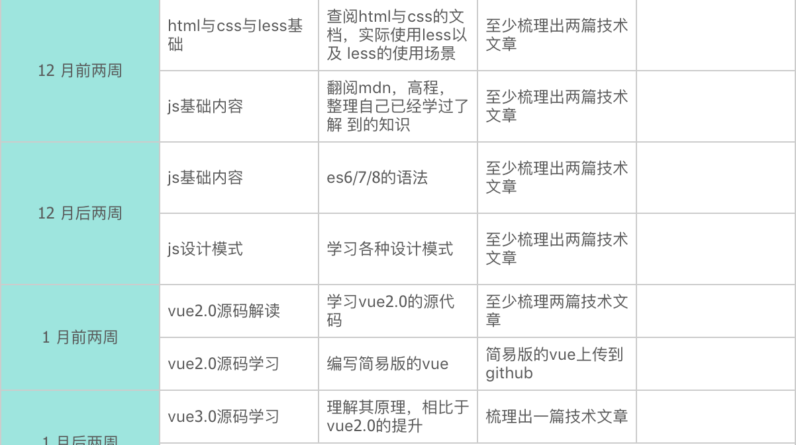

# 如何在从事前端两年，得到20+K的offer

在这个话题之前，我必须得申明下几个事情

1. 在两年内能拿到20Koffer的地区是有限的，并不是所有地区都是可以
2. 除了北上广深杭，其他地区基本不太可能达到
3. 这个只是个人经历，并不一定代表着每个人都一定能拿到

## 前言

可能大家会以为我是一个高材生，是一个比较厉害学校出来的人，但是我这边可以很明确的说，我只是一个三本毕业的普通人

在很多时候，我也是在走歪路，大三结束的那个暑假，我已经开始出来找实习了，然而，找了一个跟我现在从事的行业是毫无关联的工作，在一家创业公司待了两年之久

这两年期间，没有学习到任何跟互联网相关的内容，也没有学习到任何知识，是比较纯粹放纵的两年

后来我想出去换个工作，但是当时我什么都不会，导致我去找前端工作的原因仅仅只是因为我的朋友是做后端

> ps: 这里我可以表达下，刚刚毕业的你，或者毕业一年的你，找工作一定要看着这份工作对自身是不是有很好的成长，毕竟职业的前几年是黄金成长阶段

## 成长路径

我是从2018年7月正式踏入学习前端的行列，然而并不是所有事情都是顺风顺水的

刚刚开始学习的时候，连js有几个基本类型都不清楚

在2018年的行情下，对于这种工作一年出来找前端的工作的人，几乎是毁灭性的，可以预见，没有任何一家公司会需要这样的一个前端人员

所以最终的我是来到一家比较奇怪的公司，老板也不用弄任何东西，做的东西也是其他公司的外包，在这期间，一共大概两个月时间，我努力的学习，刷其他博客，两个月后我离职了，来到了我第一家真正意义上的做前端的公司，然而好景不长，这公司与我个人的发展（那时候已经给自己规划发展了）有严重的冲突，最终还是离开了，来到了现在这里（也就是20K+的时候）

## 如何学习

上面简短的内容，就是我自己的一个亲身经历，说是2年达到20K+，实际上我只用了1年半不到的时间，入职当前的公司我也已经有半年多了，在入职的时候就已经达到这个标准了，那么我是如何学习的呢

### 认清自己

学习的第一步，永远都是了解自身处在什么位置，知道自己当前的水平，只有这样才能清楚的知道下一步该往哪个方向去学习

在我18年7月份刚刚学习前端的时候，完全就是个门外汉，js连最基础的内容都不清楚，css除了基本的用处以外其他的一概不知，vue/react是啥都不知道，更别说npm，node等等一系列内容

这个时候看清楚自己什么不会，知道前端有什么内容，就可以进行简单的概括性的学习，让自己从0到1入门

### 学习总纲

认清自己的能力之后，需要有一个学习的规划，规划自己的学习内容，学习时间，学习方式

第一家公司待着的那两个月，我的目标其实就是只有一个，学会js，学会vue/react的使用，以至于在每天的工作之后，固定的学习2个小时以上的时间，看书，看资料，看博客，看文档，写demo

然后在入职第二家公司之后，做了一个年度学习总纲，具体学习的内容是什么，每周的学习目标是什么，将学习进行量化

这个只是冰山一角，实际上做了一整年规划，但是真的也并不是完全能够做到对应的内容，而且在不断的学习过程中，有不断的修正，每次要改动的内容也不会少

### 循环

在不断的学习中，肯定会得到更多的成长，那么就需要经常性的对自己的审视，然后重新规划自己的目标

一般的时长都是2个月左右，重新看下自己到底学到了什么，还需要对哪些方面进行针对性的强化

### 坚持

学习方法再多，其实最主要的还是坚持，有再多的学习模式，再好的学习能力，不能坚持的学习下去，那都是白费的

针对那个学习计划，我也没有达到百分百的完成，只能说他只是一个规划，具体的学习内容，还是根据你每时每刻的变化进步来决定的

但是，我坚持学习了一年多的时间，虽然中间断断续续，但是从来不会有超过1个礼拜没有学习过的情况

## 总结

做程序员，做前端工程师，真的是一个学习就会有回报的职业，不看出身高低，不看学历强弱，只要你的技术达到应有的水准，就能够得到对应的回报

学习从来没有一蹴而就，都是持之以恒的，正所谓活到老学到老，真正懂得学习的人，才不会被这个洪流所淘汰
